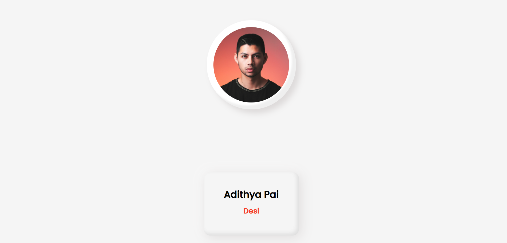
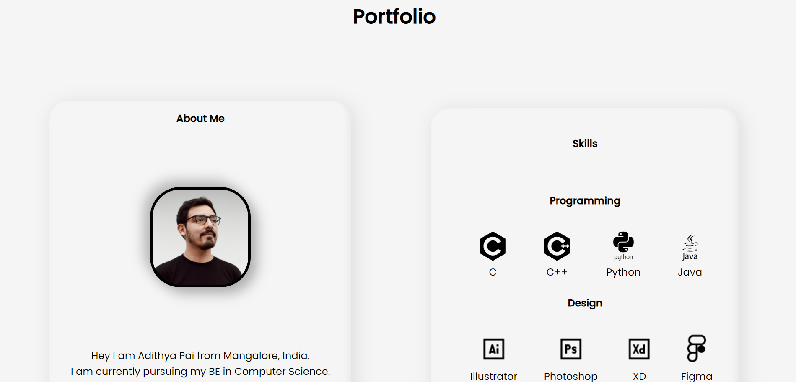
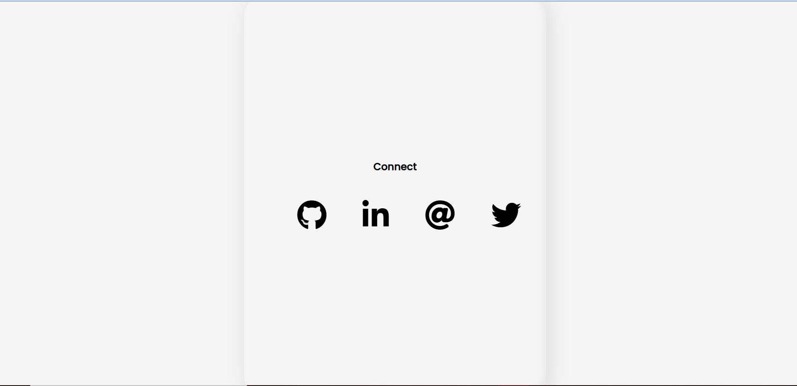

## HACKTOBERFEST IMPORTANT NOTICE

#### Please make sure your are commmiting your changes to the right branch 
#### If you PR to the wrong branch then there will be merge conflicts !!!
For any Queries pls reach me via https://www.linkedin.com/in/adithyapaib/

##


# Neomorphic-PortfolioTemplate

This is a OpenSource Portfolio Template Based on Neomorphic Theme. 

# What is Neomorphic?
Neomorphism is a relatively new design movement and a phrase that has just gained popularity. <br> Its aesthetic is defined by minimal and realistic-looking UI, which is a new twist on skeuomorphism. <br> It got its name in a UX Collective post from December 2019, and since then, various design and development communities have been actively discussing the trend, usually with differing opinions. <br> Chris poked fun at it on Twitter. Adam Giebl created an online generator for it. <br> Developers, designers, and UX specialists are weighing in on the topic of aesthetics, usability, accessibility, and practicality of this design trend.

Made with:


# Click here for Live Preview

https://adithyapaib.github.io/Neomorphic-PortfolioTemplate/

# Template Preview

This is an OpenSource Portfolio Template Based on Neomorphic Theme Made with pure HTML, CSS(SCSS), And a bit of Java script.

## Screenshots





  
## Demo

https://adithyapaib.github.io/Neomorphic-PortfolioTemplate/

  
## Features

- Responsive Layout
- Rich, multi-step animations 
- Fullscreen mode
- Aesthetic and modern UI


 ## Color Reference

| Color             | Hex                                                                |
| ----------------- | ------------------------------------------------------------------ |
| Hover Background  |  #ff1900 |
| Box Shadow  |  #b8b7b7 |
| Text |  #0000004b |
| Main Background |  #ffffff |

## New to Contributing Open Source?

No worries! We'll walk you through the steps.

Open your terminal and type the following command to clone this repository into your code editor:

```sh
git clone https://github.com/adithyapaib/Neomorphic-PortfolioTemplate.git
```

Next, make the changes you want in the code.

Once finished, you can do the following to add, commit, and push your code to your fork!

```sh
git add .
git commit -m "My contribution"
git push
```

Then, navigate over to your github fork page and click the **"Compare & pull request"** button


When prompted, type up a ***clear and well-written*** pull request title and message. This will make it much easier to review your code!

And again, thanks for contributing!
  
# Hi, I'm Adithya! 👋

## 🚀 About Me
I'm a Front-End Developer and Open-Source Enthusiast.

  
## 🔗 Links
[](https://adithyapai.com/)
[](https://www.linkedin.com/in/adithyapaib)
[](https://twitter.com/adithyapaib)

  
## 🛠 Skills
Javascript, HTML, CSS,etc..

## Authors

- [@adithyapaib](https://github.com/adithyapaib)

## Contributing

Contributions are always welcome!

See **Issues section** for ways to get started.

Please adhere to this project's **code of conduct**.

  
## Feedback

If you have any feedback, please reach out to us at paiadithya26@gmail.com

## Support

For support, email paiadithya26@gmail.com


## License

[](https://github.com/tterb/atomic-design-ui/blob/master/LICENSEs)

 


[![Contributors][contributors-shield]][contributors-url]
[![Forks][forks-shield]][forks-url]
[![Stargazers][stars-shield]][stars-url]
[![Issues][issues-shield]][issues-url]
[![MIT License][license-shield]][license-url]

#### Contributors

<a href="https://github.com/adithyapaib/Neomorphic-PortfolioTemplate/graphs/contributors">
  
</a>


<!-- MARKDOWN LINKS & IMAGES -->
<!-- https://www.markdownguide.org/basic-syntax/#reference-style-links -->
[contributors-shield]: https://img.shields.io/github/contributors/adithyapaib/Neomorphic-PortfolioTemplate.svg?style=for-the-badge
[contributors-url]: https://github.com/adithyapaib/Neomorphic-PortfolioTemplate/graphs/contributors
[forks-shield]: https://img.shields.io/github/forks/adithyapaib/Neomorphic-PortfolioTemplate.svg?style=for-the-badge
[forks-url]: https://github.com/adithyapaib/Neomorphic-PortfolioTemplate/network/members
[stars-shield]: https://img.shields.io/github/stars/adithyapaib/Neomorphic-PortfolioTemplate.svg?style=for-the-badge
[stars-url]: https://github.com/adithyapaib/Neomorphic-PortfolioTemplate/stargazers
[issues-shield]: https://img.shields.io/github/issues/adithyapaib/Neomorphic-PortfolioTemplate.svg?style=for-the-badge
[issues-url]: https://github.com/adithyapaib/Neomorphic-PortfolioTemplate/issues
[license-shield]: https://img.shields.io/github/license/adithyapaib/Neomorphic-PortfolioTemplate.svg?style=for-the-badge
[license-url]: https://github.com/adithyapaib/Neomorphic-PortfolioTemplate/blob/master/LICENSE
